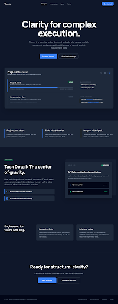

# Google Stitch Prompt: Landing Page

## Purpose

This prompt is for the first public-facing landing page exploration of Themis in Google Stitch.

It should communicate what Themis is, why it exists, and why it feels different from overloaded project management tools.

It should align with:

- `00_overview.md`
- `05_ux-model.md`
- `07_visual-discovery.md`

## Stitch Prompt

Idea
A landing page for Themis, a calm and structured project management app for software engineers, technical leads, and solo builders who manage many projects at the same time.

Theme
Calm, precise, and technically mature. Editorial structure mixed with subtle system-interface cues. Neutral-first palette, restrained accents, strong typography, generous spacing, and low visual noise. Avoid generic startup landing page patterns, decorative gradients, playful illustrations, bright SaaS marketing colors, and noisy dashboard mockups.

Content
Create one landing page for Themis.

Include:
- a clean header with Themis wordmark, simple navigation, and one primary call to action
- a hero section with a concise headline, short supporting copy, and a product preview area
- messaging that positions Themis as a calmer way to manage multiple projects and structured execution
- a section explaining the main product value: clarity, low cognitive load, project-first organization, and structured task definition
- a product preview section that highlights projects overview as the main entry screen
- a second product preview or feature section that shows task detail as the operational center of gravity
- a short section on how Themis differs from typical noisy PM software
- a final call to action section

Suggested content direction:
- focus on clarity over busyness
- emphasize multiple concurrent projects
- show that Themis helps users move from project context into clear task execution
- speak in calm, direct, structured language

The page should feel like:
- a premium product introduction
- a system built for focused technical work
- a serious but modern product

The page should not feel like:
- a startup marketing template
- a page full of feature cards and badges
- a generic PM landing page
- a sales-heavy SaaS homepage

Layout guidance:
- strong hero with clear message and one visual anchor
- sections with breathing room and clear hierarchy
- use product previews that feel believable and restrained
- avoid overloading the page with too many features at once
- show confidence through structure, not decoration

## Short Stitch Prompt

Idea
A landing page for Themis.

Content
Create one landing page for Themis, a calm and structured project management app for engineers and technical leads managing many projects at once. Include a clean header, a strong hero with concise copy and a product preview, a section explaining the core value of clarity and low cognitive load, a product preview focused on projects overview, a second preview focused on task detail, a short comparison section showing how Themis differs from noisy PM software, and a final call to action. Keep the design minimal, premium, technically mature, and far away from generic startup SaaS styling.

## Current Exploration

### Approved Screen

### Alternate Light Screen

### Alternate Dark Screen

### Exported Assets

- Approved screenshot: `./assets/landing-page-refined.png`
- Approved HTML export: `./assets/landing-page-refined.html`
- Approved Stitch screen: `Themis Landing Page Refined`
- Approved Stitch screen ID: `b13d3a79cf504f64be7250dec3addaae`
- Alternate light screenshot: `./assets/landing-page-simplified.png`
- Alternate light HTML export: `./assets/landing-page-simplified.html`
- Alternate light Stitch screen: `Themis Landing Page (Simplified)`
- Alternate light Stitch screen ID: `c2bc1d2d7ec344cebac3002d8ac46716`
- Alternate dark screenshot: `./assets/landing-page-dark.png`
- Alternate dark HTML export: `./assets/landing-page-dark.html`
- Alternate dark Stitch screen: `Themis Landing Page (Dark)`
- Alternate dark Stitch screen ID: `03e9700517ab4fe697fc2f4ae187f8df`

## Review

The landing page direction is now approved.

The refined light version is the main baseline for Themis. The simplified version remains a useful alternate reference for clarity, and the dark version is a strong variant for future branding exploration.

### Approved Qualities

1. the hero is clear and product-focused
2. the overall structure explains Themis quickly
3. the product previews feel more aligned with the approved internal screens
4. the features section is more specific and less generic
5. the page feels calm, premium, and believable
6. the dark variant extends the system without losing the product tone

### What To Preserve

1. clear hero promise
2. simple product explanation
3. product-grounded feature language
4. alignment with approved projects and auth directions
5. restrained, technically mature visual tone

### Documentation Status

- status: approved baseline direction
- approved light variant: `Themis Landing Page Refined`
- alternate light variant: `Themis Landing Page (Simplified)`
- alternate dark variant: `Themis Landing Page (Dark)`

### Recommended Structure

1. Header
2. Hero with one clear promise and one product preview
3. Short explanation of the problem Themis solves
4. Projects Overview product preview
5. Task Detail product preview
6. Simple closing CTA

### Recommended Copy Direction

Prefer:

- `Project management with less noise.`
- `Themis helps you manage multiple projects with clarity.`
- `See projects clearly. Define tasks properly. Keep execution visible.`
- `Built for engineers and technical leads managing parallel work.`
- `Projects, not chaos.`
- `Tasks with definition.`
- `Progress with signal.`

Avoid:

- `command center`
- `technical manuscript`
- `ledger architecture`
- `stakeholder velocity`
- `enterprise scale`
- `system is different`

## Refined Prompt For Next Stitch Pass

Idea
A landing page for Themis.

Theme
Calm, direct, and product-focused. Minimal, premium, and technically mature. Neutral palette, restrained accents, strong typography, and low visual noise. Avoid sounding like an infrastructure platform, manifesto, or startup marketing site.

Content
Create one landing page for Themis, a project management app for engineers and technical leads who manage multiple projects at the same time.

Include:
- a simple header with Themis, a few normal navigation links, and one primary call to action
- a hero with a very clear headline, one short supporting paragraph, and a product preview based on the approved Projects Overview screen
- a short section explaining the problem: most PM tools create too much noise and make multi-project work harder to manage
- a three-part features or value section, but make it specific to Themis rather than generic marketing language
- a product section focused on Projects Overview as the main entry point
- a product section focused on Task Detail as the place where work becomes clearly defined and execution stays visible
- a short closing CTA

Use simple, direct language.

Avoid:
- conceptual platform language
- invented metrics and analytics widgets
- infrastructure-heavy copy
- manifesto-style sections
- generic feature cards or generic value statements
- fake dashboard complexity
- waitlist marketing language

Layout guidance:
- keep the page shorter and more focused than the current version
- make the hero explain the product quickly
- use the real approved product directions as previews
- make the features section feel product-specific and concrete
- emphasize product clarity over atmosphere
- make the page feel believable, useful, and easy to understand in under one minute
