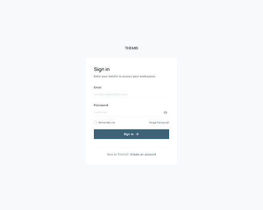

# Google Stitch Prompt: Sign In

## Purpose

This prompt is for the sign-in screen of Themis.

They intentionally avoid repeating the full visual-system guidance already defined in:

- `07_visual-discovery.md`
- `10_stitch-dashboard-prompt.md`

Use the existing product design direction and design system context.

Scope is intentionally limited to **one screen only** so Stitch can produce a more controlled result.

## Stitch Prompt

Idea
A sign-in screen for Themis, a structured project management app used by software engineers, technical leads, and solo builders.

Content
Create a sign-in screen with:
- Themis brand at the top
- a clear heading and one short supporting sentence
- email field
- password field
- show/hide password control
- primary sign-in button
- secondary link to create an account
- forgot password link
- optional remember me control
- a subtle area for validation and error messages
- a calm, balanced form layout centered on the page
- realistic spacing for desktop and mobile

The screen should feel focused, calm, exact, and efficient.

Avoid:
- marketing sections
- testimonial blocks
- feature grids
- social sign-in options unless explicitly needed
- split-screen illustrations unless they are extremely subtle
- crowded layouts or too many competing actions

Layout guidance:
- one primary form card or panel only
- strong visual hierarchy with the heading, fields, and primary action
- supporting actions should stay visually secondary
- keep the composition minimal and easy to scan
- prioritize form clarity over decoration

## Short Stitch Prompt

Idea
A sign-in screen for Themis.

Content
Create one sign-in screen only. Include the Themis brand, a heading, short supporting text, email field, password field, show or hide password control, remember me option, forgot password link, primary sign-in button, create account link, and a subtle area for validation or error messages. Keep the layout centered, calm, minimal, and highly structured. Avoid marketing content, extra panels, or crowded UI.

## Current Exploration

### Screen

### Exported Assets

- Screenshot: `./assets/themis-sign-in.png`
- HTML export: `./assets/themis-sign-in.html`
- Approved Stitch screen: `Themis Sign In (Simplified)`
- Approved Stitch screen ID: `c8ad8798d7d047d184b696eb3cbfd096`

## Review

The sign-in direction is now approved for Themis.

### Approved Qualities

- the neutral palette is aligned with Themis
- the single-column composition is correct
- the overall restraint avoids generic SaaS auth patterns
- the input styling language fits the product system
- the page feels calm, exact, and product-focused
- the composition is tight enough to keep sign-in fast and clear

### What To Preserve

1. a single-column centered layout
2. one quiet primary form panel
3. plain language and straightforward field labels
4. limited secondary actions
5. minimal decoration and no extra marketing sections

### Documentation Status

- status: approved direction
- use this screen as the auth baseline for future sign-up, recovery, and verification screens
