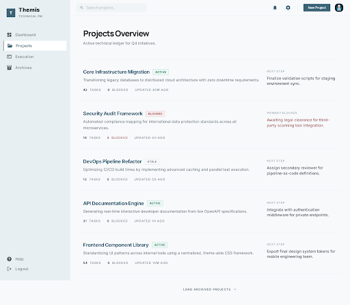

# Google Stitch Prompt: Projects Overview

## Purpose

This prompt is for the next main-screen exploration of Themis in Google Stitch.

It replaces the task-heavy dashboard as the preferred first impression.

It should align with:

- `05_ux-model.md`
- `07_visual-discovery.md`

## Stitch Prompt

Idea
A projects overview screen for Themis, a structured project and task management app for software engineers, technical leads, and solo builders who manage many projects at the same time.

Theme
Calm operational notebook. Precise, modern, and technically mature. Neutral-first palette, restrained accents, strong typography, low visual noise, and minimal chrome. Avoid generic SaaS dashboard patterns, heavy KPI panels, crowded kanban layouts, colorful status overload, and enterprise control-room aesthetics.

Content
Design one projects overview screen only.

Include:
- a top page header with the Themis brand or workspace label, search, and one primary create action
- a short page heading that communicates this is the cross-project workspace
- a projects list or grid for multiple active projects
- each project block should show project name, concise summary, current status or momentum, task counts by state, one notable next step or blocker, and recent activity age
- each project block should include a clear path into the project without feeling like a dense dashboard card
- light filtering or sorting for status, owner, or recency
- a restrained secondary rail only if it adds calm cross-project context such as stale projects, major blockers, or recent decisions

The screen should feel like:
- a clear entry point into multiple parallel workstreams
- a calm operational briefing
- a premium, structured product workspace

The screen should not feel like:
- a task board
- a noisy analytics dashboard
- a grid of generic SaaS cards
- a PM admin console

Layout guidance:
- prioritize projects over tasks
- give each project enough breathing room to feel important
- use typography and spacing before borders and filled cards
- keep the page easy to scan in under 10 seconds
- reduce secondary controls and avoid overcrowding the header

## Short Stitch Prompt

Idea
A projects overview screen for Themis.

Content
Create one projects overview screen only for Themis. Show multiple active projects in a calm, structured layout with strong first-impression clarity. Include a top header, search, one primary create action, and a list or grid of project blocks. Each project should show its name, short summary, task counts by state, one important blocker or next step, and recent activity age. Keep the screen minimal, premium, and easy to scan. Avoid dense task dashboards, heavy analytics, and generic SaaS card grids.

## Current Exploration

### Screen

### Exported Assets

- Screenshot: `./assets/projects-overview.png`
- HTML export: `./assets/projects-overview.html`
- Current Stitch screen: `Projects Overview (Utilitarian)`
- Current Stitch screen ID: `122fc46a33464f72a9391d72014a28b2`

## Review

The projects overview direction is now aligned for Themis. This utilitarian version is the right baseline for the product.

### Approved Qualities

- projects-first entry is still the right product decision
- clear orientation across multiple active projects
- project-level grouping is stronger than task-first entry
- the visual treatment is calmer and more believable
- repeated structure makes the page easier to scan
- the screen feels more useful than decorative

### What To Preserve

1. projects-first entry point
2. repeated project-block structure
3. restrained hierarchy and low visual noise
4. concise project summaries with operational signals
5. utilitarian tone over visual novelty

### What To Watch In Future Iterations

1. do not drift back into card variation or dashboard metrics
2. keep decorative ideas secondary to readability
3. preserve the utilitarian calm as more features are introduced

### Documentation Status

- status: approved baseline direction
- use this screen as the baseline for future project-level navigation and landing-page product previews
